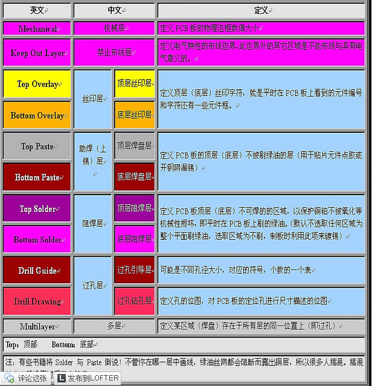
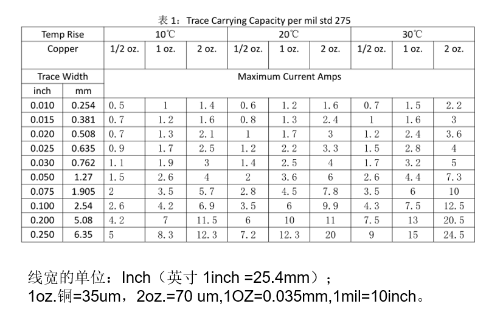
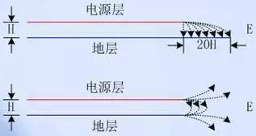
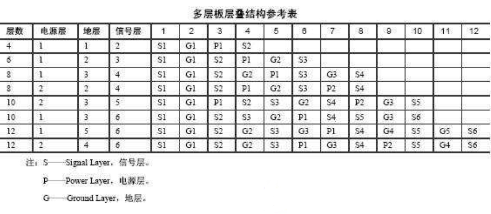

# SCH & PCB 设计规范和 AD 的使用（SCH-&-PCB-rules-and-AD`s-usages）

***p.s 温馨提示：点个 star 收藏一下回头慢慢看；或者下(白)载(嫖)下来，在 Typora 中阅读；或者在  [本文知乎地址](https://zhuanlan.zhihu.com/p/356679916)  阅读；整理不易，请多支持。***

编辑整理 by [Staok](https://github.com/Staok)，始于 2020.7 且无终稿。转载请注明作者及出处。

本文件是“瞰百易”计划的一部分，尽量遵循[“二项玻”定则](https://github.com/Staok/Please-stay-in-the-future)，致力于与网络上碎片化严重的现象泾渭分明（这中二魂...）！

本文系广泛撷取、借鉴和整理，参考的公开文档、书籍和网页**不可数**、太多了。

适合刚入门的人阅读和遵守，已经有较多经验的人看一看图个乐。如有错误恭谢指出！

------

## O 目录

[TOC]

------

## 0.5 其他优秀的参考文章

-   [PCB 基本布线规范与设计原则 by Hank](https://uinika.gitee.io/Electronics/PCB/)

## 1 最基本的电路检查项和器件选型

### 关于电路模块化

-   电路原理图必须要模块化，便于以后的开发可以直接参考或复制之前已经设计的固定下来的功能模块。
-   电路板实体的模块化（接口形式可以是 插接键 或者 邮票孔 ），要视具体应用而定：如果电路板要抗震、要空间集成度高（即占用空间紧张）、要低噪声（即精密设计），那么就不宜用电路板实体的模块化，那么此时直接用原理图模块化的形式（可以借鉴或复制之前设计的模块化的原理图）进行原理图设计，然后所有器件画在一个板子上，PCB也直接借鉴之前的设计，这样就实现比较高效的设计。

### 保护机制

-   过压，欠压，防反接，软起动。
-   过流，过温。
-   瞬态抑制，静电保护，浪涌保护，EMC/EMI，RC消火花。
-    通讯接口、驱动 I/O 保护：加缓冲，加隔离。
-   共模、差模干扰抑制。
-   共阻抗地干扰抑制（高频）。

### 电源

-   确定入、出的压、流范围，纹波，温度特性。

-    保护机制是否完善。

-   各个用电模块的地隔离，输入端做好滤波，即 EMC 考虑。

-   电源布局推荐：

    

### 模块分离

-   要进行电源分割、空间远离和地线单独安排等措施。
-   各个部分接各自独立的“地”，最后都各自单点接公共地。
-   模块特性区分：
    -   数字部分供电电源，给数字电路。
    -   模拟部分供电电源，给模拟电路。
    -   强信号、大电流部分 与 弱信号（又分高频、低频）部分。
    -   高电压区域 与 低电压区域。
    -   干扰源 与 敏感元件。

### “地”的类型

要划分这些“地”，防止互相干扰，每一个“地”单独划分区域，单独覆铜；一般方法是单点接地，都连接到电源地上，参考上面“电源”中配图。

-   电源地（PGND）（各个电压的地）
-   模拟地（AGND）
-   数字地（DGND）
-   负载地（外接的电机等大负载进行隔离）
-   外接传感器地（外接模块地隔离，或者共模电感隔离）
-   机壳地，外壳地

### 电源完整性的测量及电源分配网络PDN的参数

-   纹波和噪声的测量。
-   输出阻抗的测量。
-   环路增益的测量。
-   滤波器件（电容/磁珠等）性能参数的测量。

### 电阻，电容，电感

-   电阻：阻值，功率，精度，温漂，品牌厂家，封装，价格。
-   电容：容值，耐压，材质（优先选：固态，铝聚合物，陶瓷电容（NPO，X7R），钽电容（大容量的钽电容耐压很低）），ESR（等效电阻，要低），纹波电流额定值（rated ripple current），温度特性，泄露电流，封装，寿命年限。
-   电感：感值（看感值随温度下降的图表），饱和电流（或温度特性），直流电阻（DCR），封装大小（一体成型的0630/4040，扁铜带/扁铜线型，铁硅铝（做差模电感最合适））。
-   关于阻容的封装的补充说明：电阻的直插（金属）封装比表贴（碳膜）和电容的直插（MLCC独石，NPO或X7R）比表贴（陶瓷，NPO或X7R），要来的更加稳定（如热稳定），噪声可能更小。对于要求精密、稳定的硬件可选此。

### 开关管

-   Vds（漏源极电压），Vgs（栅极源极电压），Ids（漏源电流），Rds（on）（导通电阻）。
-   分布/寄生电容（符号：Cs，Cg。其越小，开关速度越快，开关损耗越小），选NexFET型；封装。

### 运放

括号内为最廉价运放的典型值。

-   输入、输出电压范围（供电是否必须双电源，输出是否轨到轨），带宽/摆率/电压转换速率SR（0.5V/us），开环差模增益（Aod，100dB或105）/频率响应/伯德图/频带宽（-3dB的f），放大倍数温漂。
-   差模输入阻抗（rid，大于2MΩ），共模输入阻抗，共模抑制比（KCMR，大于80dB）。
-    输入失调电压（Uio，小于2mV），输入失调电流（Iio，0.2~2uA），输入偏置电流（Iib，0.3~7uA），它们的温漂。
-   功耗（80mW）。

### MCU

-   内核架构，RAM，ROM，I/O数量，通讯接口（串口，SPI，I2C，CAN，USB，SDIO，FMSC等），其他特色外设，抗扰能力。
-   工具链是否齐全，是否支持FPU，DSP。
-   最小系统：供电电源，时钟（晶振等），复位（RC + 开关，内部看门狗，专用看门狗芯片等），SRAM（可选），FLASH（可选）。
-   功耗，价格，封装大小，供货周期。
-   如无必要，勿增实体！

## 1.5 硬件测试规范化

硬件测试（或称可靠性检验）的指标条目、每个项目的测试步骤和测试报告等规范化。

（这条目前对于我个人是空白的，以后慢慢积累补上）。

## 2 SCH 绘制规范和 AD 使用

个人规范，仅供参考。

在使用AD时候，应先导入我的软件配置和PCB规则Rules文件，具体文件和方法说明在“AD 软件设置和PCB规则Rules配置文件”文件夹中。

### SCH 中的快捷键

-   拖住器件时，按x、y为镜像。
-   选中一根线，Ctrl+R，可以复制重复放置。
-   ...

### 最基本的 SCH 绘制过程

1.  对电路原理图进行电源、主控和其他外设等模组分页绘制。

    

2.  对于每一页SCH：

    -   各个子模块用线格划分；

    -   并在各个格子里写上子模块名称；
    -   页面右下角写上本页名称，x / Total（x 当前页编号，Total 为总页数），作者和日期；
    -   可在子模块旁边放上实物图片、官方推荐PCB图等方便画原理图；
    -   信号/小电流线用细线，电源/驱动/大电流线用粗线。

    

3.  原理图作画要布局工整，走线清晰，注释到位！

    

4.  每个器件的命名。在 Designator 写上准编号，电容是C?，电阻是R?，电感L?，芯片IC?，晶体管Q?，以此类推；在 Comment 写上器件的名称。

    

5.  原理图画好后该给各个元件建立唯一编号。打开“工具”->“注解”，点 Reset All ，再点“更新更改列表”，最后执行“接受更改”。

6.  对于没有 PCB 封装的元件：

    -   常见的可用 IPC 自动创建常用封装工具，先选择封装类型，再根据手册设置各种长宽参数，自动生成PCB封装以供使用。
    -   不常见的去 ST 等大厂官网对应 IC 页中寻找提供的 PCB 封装进行下载。
    -   至于 3D 模型，简单的可在 AD 的 PCB 库中的元件上添加 3D 实体（通常在机械1层）自己画，复杂的可用去“IC封装网”（http://www.iclib.com）等网站下载。[找3D模型和导入的一个教程](http://bbs.21dianyuan.com/forum.php?mod=viewthread&tid=174773)。

7.  对原理图进行编译和查错。依次点 “工程”->“Compile Document” 和 “工程”->“Compile PCB Project”。没错后即可导入PCB。

## 3 PCB 绘制规范和 AD 使用

### 板层标识定义

Top Overlay为丝印层
Top Solder为开窗层
Keep-out Layer为板边界

### PCB 中的快捷键

-   q 为单位在 mil 和 mm 之间切换。
-   拖住器件，按下 L 切换器件所在层。
-   Ctrl+鼠标左键点击一根线为高亮此线，点右下角“清除”清除高亮。
-   按住 Alt，鼠标在板子器件上运动，会显示器件轮廓。
-   Shift+s：为高亮所在层，重复操作取消高亮。
-   处于布线状态时，shift+空格为改变线类型，空格为改变线凹凸。
-   Ctrl+g：为选择切换栅格类型为线或点。
-   Backspace 为布线时回到上一步。
-   线状态下按*（乘号）为带过孔换层。
-   Ctrl+m：为测量长度。
-   Ctrl+左键点一下对正在布的线完成自动布线连接。
-   Ctrl+H：再点一根线会全选之，然后 del 删除整根线。
-    Shift+h：PCB 的左上角状态栏是否显示。
-   Shift+g：PCB 左上角状态栏是否固定不动。
-   键盘上边数字“3”为显示 3D 视图，数字“2”还原。
-   3D 视图中依次点“v”、“b”->翻转板。

### PCB 布线技巧

-   多跟线一块走：先选中多跟线，点“交互式布多跟线”，再点任一个线，就并排走了。

-   蛇形线参考：[参考链接](https://wenku.baidu.com/view/7962833ceefdc8d376ee3254.html)

    先走好线，然后等长线都加到一个网络，按T R，选择最长线确定，移动鼠标拖蛇形线。

    快捷键：“1、2”改弧度，“3、4”改间距，“，、。”改绕长，在左下角导航选“PCB”窗口，可见加入网络的要等长的线及其各自的长度。

### 最基本的 PCB 绘制过程

要全程符合“PCB 布局布线规范”章节内容。

1.  先定义PCB规则。点开“设计”->“规则”，主要设置线宽范围，元件最小间距，焊盘的开窗范围，默认过孔尺寸，覆铜类型为直接连接等。

    过孔尺寸：焊盘比孔至少大6mil。例如最小孔直径为12mil（0.305mm），焊盘直径至少18mil。

2.  划定板边界。在 Keep-out Layer 层绘制板边界闭合线，然后执行“设计”->“板子形状”->“按照选择对象定义”。

3.  放置 PCB 原点到 PCB 边界的左下角。依次点击“编辑”、“原点”和“放置”，然后放置原点。

4.  把每个模块包含的所有元件移动到一堆。

    -   首先开启交叉选择，分别打开在原理图和PCB界面的“工具”->“交叉选择模式”选项。

    -   在原理图界面中，选中一个子模块内所有器件，再到PCB界面，点“排列工具”->“在区域内排列器件”，在空白区域内拖出一个矩形，此子模块所有的器件便都堆在此矩形区域内。

5.  PCB中显示元件的原名（此步骤非必须）。

    -   随便选中一个元件，右键点开“查找相似对象”，都是“any”情况下点“应用”，此时所有器件已全选，再点“确定”，出现“PCB Inspector”窗口，在其中取消选中“Show Name”，打开选中“Show Comment”即可。

    -   PCB Inspector 对于多器件批量改属性特别好用。选中要统一修改的器件，然后按 F11 调出 PCB Inspector 窗口，然后在 PCB Inspector 窗口改属性，所选中的多个器件就一同更改了。

6.  多层板（多于 2 层的偶数层）。

    -   在 PCB 里连按快捷键“D”、“K”调出层叠管理，或者在“设计”里面找“叠层管理”，或者空白处右击，“选项”里的“层叠管理”。
    -   多层板的推荐板层分布图在“PCB 布局布线规范”章节的“中学生级”里。
    -   注意内电层在拼板的时候网络会丢失，暂时没有简便的办法。有内电层在需要拼板的时候，建议这样处理：先把PCB文件直接复制一个，命名为“xxx 不含内电层版.PcbDoc”，然后打开此文件，执行以下步骤：
        1.  先把内电层的分割线都删掉，然后 D K 快捷键调出板层管理，把内电层（负片层）删掉，换为普通层（正片层）。
        2.  然后在新的普通曾里按照原来分割线的形状覆铜，网络选择跟原来一样。
    -   四层板举例：
        1.  在“层叠管理”中，在中间添加“Signal1”和“Signal2”两个信号层，或者添加“GND”和“VCC”两个内电层(Internal Plane)；
        2.  前者的信号层可直接布线。后者的内电层特性为负片，即布线的地方不铺铜，什么都不画的时候是一整块铜皮，专用于电源划块，即内电层分割；双击一个封闭区域可设置此区域覆铜连接的net。
        4.  信号层和内电层可以各有一个，混搭组成四层板，这样内电层专走电源和地，还多了一个信号层。
        5.  其他注意点：画线不要用交互式走线，要用工具栏中的“应用工具”的“走线”等功能；典型内层厚度为1.4mil；通常采用默认的 Layer Pairs（层成对）模式；不允许在内电层上布置信号线；内电层不同区域之间的间隔宽度不小于 40mil。
        6.  典型四层板板层分布为（由上到下）：
            -   **信号层 - 内电层（GND层） - 电源层 - 信号层**（把信号层露在外面是为了好实物修改，也可不这样）
            -   **信号层 - 内电层（GND+VCC层）- 信号层 - 信号层**
    
7.  元器件布局。

    -   布局的好，走线容易，布局不好，走线困难。
    -   先大后小，先难后易，均匀分布，整齐划一。
    -   数模分离；功率驱动和信号处理分离；高频低频分离。
    -   间隔充分，模块独立。
    -   根据主信号流向摆放主要元器件。
    -   整齐美观，有规律。
    -   更多请参考“4 PCB 布局布线规范”章节的内容。

8.  布线。

    -   除非可以混过去的项目，否则坚决不用自动布线（你晓得）。
    -   不手动布地线，地线的布线在下一小节“后续工作和润色”中用覆铜和过孔解决。
    -   对于两层板而言：先走电源线，再走信号线；对于四层板而言：摆好器件，先划分好内电层区域，再走电源线，再走信号线。
    -   电源线足够粗，功率走线必要时考虑开窗加锡。
    -   走信号线时，模拟信号、高速信号和时钟线优先布线。
    -   电流和地路径不形成环。
    -   交互式走线和蛇形线：
        -   多跟线一块走：先选中多跟线，点“交互式布多跟线”，再点任一个线，就并排走了。
        -   蛇形线参考：先走好线，要等长的线都加到一个网络，按T R，选择最长线确定，移动鼠标拖蛇形线，“1、2”改弧度，“3、4”改间距，“，、。”改绕长，在左下角导航选“PCB”窗口，可见加入网络的要等长的线及其各自的长度。[参考网址](https://wenku.baidu.com/view/7962833ceefdc8d376ee3254.html)。

9.  后续工作和润色。

    -   板边缘圆润。
    -   电源芯片下方的 PAD 处仅加一个超大的过孔，而不是一堆小过孔，小过孔会被焊锡堵住。
    -   加泪滴。
    -   加螺丝定位孔。
    -   覆铜，原理图和器件布局时候按照“地”的划分而讲究，覆铜也按照这个讲究来讲究。
    -   每一块覆铜之间间隔在2mm以上，尤其是高压和低压区域的覆铜。
    -   对于覆铜，确保不出现较大的（超过 150mil）死铜、孤铜。覆铜不要有尖端或者细支延申或者存在于焊盘之间的覆铜的细线，可以在要去掉尖端的地方放置多边形占着地方，然后重新更新一下覆铜，尖端的地方就没有了。
    -   敷铜不要有尖锐的边角，四周要圆润。
    -   绕着模块加大的过覆铜过孔，板子四周加一圈过覆铜过孔，板子内多加过覆铜过孔增加回流路径。
    -   每一个滤波旁路电容的地脚旁边放一个地过孔。
    -   每一个芯片底部有尽量完整的地覆铜和过孔。
    -   注意过孔不要露铜。
    -   在丝印层加板子的接口（电源、通讯接口等）、Logo等标识。
    -   留下必要的测试点（开窗点），直径至少大于 0.4mm，测试点周围至少 2.54mm 空间以内要保持空旷。

10.  工艺边

     工艺边是为了满足自动化贴片的需要而增加的辅助部分，生产完成之后会被移除，一般设计为 5mm。

     -   定位孔: 用于 PCB 加工和测试时的定位，一般设计为 2mm 的过孔。
     -   Mark 点: 用于自动化贴片机进行识别定位，通常设计为 1mm 的焊盘。

11.  PCB 画好后，执行 DRC 检查！

12.  拼板。

     1.  新建一个PCB，选择“放置”->“内嵌板阵列”或者拼板之类的（不同版本名字不同），选择要拼板的源文件、更改阵列参数和更改间距参数等即可。
     2.  两板的连接处中间加两排或者一排过孔（邮票孔：一般0.8mm大小的非金属化过孔，间距1.1mm，五个为宜），拿到后可直接掰开，掰开后再处理平滑一下边缘，而省去切割。
     3.  或者用粘贴的方法。把要拼的板子的PCB文件复制一份，打开新复制的文件，全选并复制，原点要在最左下角，然后点特殊粘贴，只勾选“duplicate designator”（如果勾选“Keep Net Name”，那么多个板同名线会显示未连接），然后点“粘贴”或者“矩阵粘贴”，然后选不进行重新覆铜即可。

可点击“生成PCB封装库”，把当前 PCB 里面所有器件的封装单独做一个 PCB 封装库。

缩减PCB文件体积：[参考网址](https://jingyan.baidu.com/article/5d6edee2e97ccb99eadeecf4.html)

更多常用技巧都总结在我创建的“PCB实验-画板技巧综合.PcbDoc”里。

## 4 PCB 布局布线规范

### 幼稚园级

1.  走线没有锐角和直角拐弯，可以走 T 型线。

2.  元件引脚下的焊盘不能放过孔。

3.  功率线、信号线尽可能短，功率线要足够粗，必要时应开窗加锡，并且大电流线、电源线之间的间隔应大于30mil，内电层不同区域之间的间隔宽度不小于 40mil。

    线宽和电流能力关系表：

    

    

    过孔直径和电流能力关系表：（看工程实践一栏；孔径高于 0.5mm 时，每增加 0.5mm ，电流能力增加 0.5A ）

    

    推荐过孔孔径：（单位 mm）

    -   信号线——0.3过孔，0.5外径，0.84电流；
    -   弱电电源线——0.5过孔，0.8外径，1A电流；
    -   大电流(多个)——1过孔，1.5外径，1.5~4A电流；
    -   大电流（多个）——1.5过孔，2外径，2~5A电流。

4.  去耦电容（旁路电容）尽量靠近IC等器件的电源输入端，滤波电容可以放置在芯片的背面，靠近芯片的电源和地引脚。

5.  多采用星形拓扑结构，少采用菊花链布局，缩短电源的公共回路。

6.  电源变换元器件（如变压器、DC/DC 变换器、三端稳压管等）应该留有足够的散热空间；干扰源（DC/DC 变换器、晶振、变压器等）底部不要布线，以免干扰。

7.  差分信号（如 USB 和 CAN 的信号线、运放输入，电流采集的差分电压信号和晶振的差分时钟信号等）紧靠并排走线。

8.  留下必要的测试点（开窗点），留螺丝孔。

### 中学生级

1.  多层板：时钟频率到5MHZ或脉冲上升时间小于5ns（五五准则），则PCB板须采用多层板。

2.  多层板：多层板的关键信号层最好位于两个地平面之间，即其电路模块的上下层所对应的区域都用地平面覆盖。

    

3.  多层板：电源平面应相对于其相邻地平面内缩5H-20H（H为电源和地平面的距离，若内缩20H则可以将70%的电场限制在接地边沿内，内缩1000H则可以将98%的电场限制在内）。

    

4.  多层板的推荐板层分布图：

    

5.  多层板：相邻布线层的走线应尽量垂直；实在无法实现垂直而必出现平行的应互相远离，或时钟、总线、射频线等关键信号走线和其他同层平行走线应满足3W原则，3W原则：线中心距不少于3倍线宽（70%的电场不互相干扰），还有更好的10W原则（98%的电场不互相干扰）。

6.  对于变压器、扬声器、电感等会产生磁场的元件，布局时应注意减少磁力线对于印制导线的切割，相邻元件磁场方向应相互垂直，减少彼此之间的耦合。

7.  元件的放置要便于调试和维修。大元件边上不能放置小元件；需要调试的元件周围应有足够的空间。发热元件应有足够的空间以利于散热；热敏元件应远离发热元件。

8.  接口电路的滤波、防护、隔离器件、EMC和整流等应该靠近接口放置；如果接口处既有滤波又有防护电路，应该遵从先防护后滤波的顺序。I/O接口电路及功率驱动电路尽量靠近PCB板边缘，即大功率器件尽可能放在电路板边缘。

9.  晶振、继电器、开关电源等强辐射器件远离单板接口连接器至少1000mil。

10.  敏感电路或器件（如复位、看门狗、信号线路等）远离单板各边缘特别是单板接口侧边缘至少1000mil，或关键信号线距参考平面边沿的距离大于3H（H为线距离参考平面的高度）。

11.  电源、模拟小信号、高速信号、时钟信号和同步信号等关键信号优先布线。

12.  过孔可能会引发信号传输线的阻抗突变，因此需要尽量减少过孔使用的数量，尤其是对于关键信号线。

13.  信号线（特别是关键信号线）换层时，应在其换层过孔附近设计地过孔。

14.  敏感信号的周围应放置多个接地过孔（宽度大于 50mil 地线或间距小于 300mil 的地孔），提供电磁屏蔽。

15.  对于金属外壳接地元件(例如晶振)，应在其投影区的顶层上铺接地铜皮。

16.  无论是时钟线、信号线还是电源线，在PCB上的走线都应该尽量短，器件紧密排布以减少PCB上走线长度；而且时钟线和信号线等在PCB上的走线应尽量用地过孔和地平面在空间上包裹；并且在PCB板的四周边缘打一圈连地平面的过孔。

17.  一个芯片的外围阻容元件应尽量靠近芯片，并尽量接近其所要连接的芯片引脚。例如，电源脚去耦电容靠近电源引脚，匹配电阻布局时候要靠近该信号的驱动端等。

18.  MCU的IRQ中断引脚等重要IO注意静电保护等，可加TVS保护管，防正负过压的保护二极管。

19.  小型化是产品开发的必经之路，挑战极限才有竞争力。

### 本科级

开始触及知识的盲区了。

1.  信号完整性（SI）分析。考虑传输延迟（蛇形线），反射（阻抗匹配，线长不要是1/4波长的整数倍），串扰（元件和导线的磁场相互垂直、平行线相互远离（3W原则）、信号线间用地平面隔离等）等等。
2.  电源完整性（PI）分析。
3.  阻抗匹配的内容，也需要遵守，属于原理图设计部分：高频电路源与目的之间的阻抗匹配非常重要，错误的匹配会带来信号反馈和阻尼振荡。过量地射频能量则会导致 EMI问题。此时，需要考虑采用信号端接；滤波器选型的阻抗失配准则：对低阻抗噪声源，滤波器需为高阻抗（大的串联电感）；对高阻抗噪声源，滤波器就需为低阻抗（大的并联电容）；降低敏感线路的输入阻抗有效减少引入干扰的可能性；LC滤波器 在低输出阻抗电源和高阻抗数字电路之间，需要LC滤波器，以保证回路的阻抗匹配；降低敏感线路的输入阻抗。
4.  对于高频电路，需要考虑元件之间的分布参数的影响。

## 5 AD 导出 BOM 表

用时再学：https://jingyan.baidu.com/article/0eb457e501efda42f0a9056a.html

## 6 AD 导出 Gerber 和 钻孔文件

用时再学：https://www.bilibili.com/video/BV1n4411L7c9

## 7 AD 导出配置文件

（@TODO）AD 软件的原理图和PCB的我的配置导出一个配置文件，以后新建时候直接导入配置。

## 7 使用 KeyShot 10 渲染三维模型

B站等有很多教程视频，以下只经验之谈。

### 基本步骤

-   用Altium Designer导出.step格式的3D模型文件，再导入keyshot，但这个模型不带走线和丝印。
-   导出表面贴图：在Altium Deigner里面使用“智能PDF”分别导出正反面的只有“走线和丝印”两个层的图，注意颜色可选，然后可以把这个pdf使用PS简单修一修（比如颜色修改和过孔透明），再导出.png格式的图。省事的做法可以直接在AD的3D视图截图，然后贴到keyshot的PCB板面上。
-   PCB板面添加贴图：然后把贴图添加到keyshot中PCB模型的板面的材质里面的标签里面。如果板面不加材质，保持原色，则直接在其材质面板下的纹理下的颜色双击添加图片，映射类型选平面，对准选部件，然后点移动纹理调整，调整使这个图像对齐贴合PCB板面即可，另一面的图片再在标签里添加。

### KeyShot 的几个初级技巧

（毕竟只是看一下效果，不是专业的）

-   3D视图下，tools菜单下的legacy tools可以导出带走线的，带丝印的模型，但是文件太大，keshot会卡，对电脑性能要求很高,我还没测试。
    没试
-   高版本的AD，可以导出pdf3d 没试
-   单个模型加材质：单击选中一个模型（出现橘色描边），然后添加材质。或者双击这个模型，右边菜单下面点“接触链接材质”
-   单独删除模型，先模型右击点分离，便可删除单独部件。
-   右边菜单 什么都不选 全局设置的情况下 有 照明和图像里面很多不错的效果可以调整
-   材质和打光：https://www.bilibili.com/video/BV14W411d7Hx
-   动画制作：https://www.bilibili.com/video/BV1T741177WU